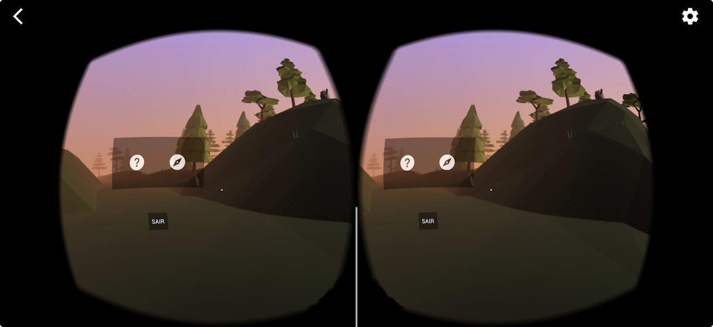
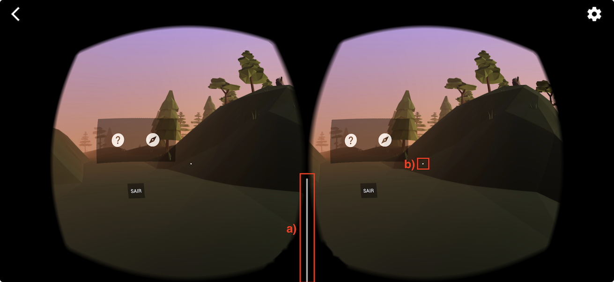

[Unity_AssetSore]: <assetstore.unity.com/account/assets> "Unity_AssetSore"
[RVi - Realidade Virtual Imersiva]: <../Unidade1/atividadeAula.md#tema-a> "RVi - Realidade Virtual Imersiva"
[RA - Realidade Aumentada]: <../Unidade1/atividadeAula.md#tema-b> "RA - Realidade Aumentada"
<!-- [RL - Realidade aLternativa]: <../Unidade1/atividadeAula.md#tema-c> "RL - Realidade aLternativa" -->
<!-- [MV - Metaverso]: <../Unidade1/atividadeAula.md#tema-d> "MV - Metaverso" -->

[LDTT_DefesaCivil]: <https://drive.google.com/open?id=1HnItO60iTpd3bTNIxkrSBpxTurWLvP_r&usp=drive_fs> "LDTT_DefesaCivil"
[GoogleCardboard_Aplicativo]: <https://play.google.com/store/apps/details?id=com.google.samples.apps.cardboarddemo&hl=pt_BR> "GoogleCardboard_Aplicativo"  
[GoogleCardboard_Desenvolvimento]: <(https://developers.google.com/cardboard?hl=pt-br> "GoogleCardboard_Desenvolvimento"  
[Vuforia_Desenvolvimento]: <https://developer.vuforia.com/> "Vuforia_Desenvolvimento"

# Realidade Virtual - Unidade 3

Algumas anotações feitas na aula: [aulaAnotacoes.md](./aulaAnotacoes.md "aulaAnotacoes.md")  

## Conteúdo

- Ambientes de desenvolvimento em Realidade Virtual:  
  - Softwares de Realidade Virtual  
  - IDEs, Linguagens, Bibliotecas e/ou Frameworks  

## Objetivos

- explorar plataformas, bibliotecas, ferramentas e linguagens para desenvolvimento de ambientes de Realidade Virtual.  

## RVi

Para o desenvolvimento de um aplicativo com [RVi - Realidade Virtual Imersiva] pode-se iniciar usando um aplicativo pronto para testar o uso do Óculos Virtual com o Smartphone. Existe o aplicativo da própria Google, o [GoogleCardboard_Aplicativo].  

  
Nesse aplicativo, se deve observar dois pontos:  

a) essa linha vertical deve sempre aparecer centralizada entre as duas regiões das imagens, pois, caso contrário, tem algum problema com as configurações do smartphone e/ou aplicativo.  
b) cursor virtual, que sempre aparece centralizado na tela, e, após alguns segundos, parado em uma posição, seleciona uma opção.  

  

Também tem um outro aplicativo desenvolvido no LDTT-FURB para a Defesa Civil de Blumenau: [LDTT_DefesaCivil].  

Já para o desenvolvimento, se pode usar duas formas:  

- [GoogleCardboard_Desenvolvimento]: ambiente de desenvolvimento da própria Google.  
- Template do Unity Hub.  

## RA

Já, para o desenvolvimento de um aplicativo com [RA - Realidade Aumentada] se tem duas formas:

- com marcador: [Vuforia_Desenvolvimento].  
- sem marcador: Template do Unity Hub.  

## Atividade de Aula

Agora é o momento de planejar o **aplicativo** que será desenvolvido como um projeto dessa disciplina. Para isso, peço que usem o arquivo [PlanejamentoAplicativo](PlanejamentoAplicativo.docx) para planejar como será desenvolvido esse projeto.  
Esse planejamento deve ser salvo na pasta unidade_3 do respectivo GitHub de cada equipe.  

E, em seguida, as funcionalidades definidas para o desenvolvimento do **aplicativo** devem ser distribuídas (de forma equilibrada) entre os integrantes da equipe, definindo um responsável por cada funcionalidade. Para essa organização, se aconselha fortemente usar um Kanban, que pode ser o que o próprio GitHub disponibiliza.  

### Unity - IDE

Uma breve descrição das principais funcionalidades do Unity pode ser vista em: [Unity/README.md](Unity/README.md "Unity/README.md")  

#### Unity - Curso

Fazer o curso sobre Unity para praticar conceitos relacionados com este motor de jogos  
Link: <https://www.udemy.com/share/101IFc3@cc15Cc09RRi4yhvNL17lYSoHfd2Sagan3-tQIIldehXIIHY8AdA4ipDhZ2C0-kT5/>  

### Unity - Asset Store

Sempre que possível, de preferência em usar os Assets (recursos) da própria loja da Unity [Unity_AssetSore]. Até é possível usar Assets externos (Ex.: [Objetos e imagens gráficas](#objetos-e-imagens-gráficas)), mas os da loja da Unity ([Unity_AssetSore])tendem a ter menos problemas para serem usados.  
A [Unity_AssetSore] disponibiliza vários Assets gratuitos, mas também podem usar alguns assets já comprados usando o usuário:

```text
  User: dalton@furb.br  
  Pwd : Furb2022  
````

### Objetos e imagens gráficas

- <https://www.svgrepo.com>
- <https://undraw.co>
- <https://icons8.com.br>
- <https://opengameart.org>
- <https://sketchfab.com>

----------

## ⏭ [Unidade 4](../Unidade4/README.md "Unidade 4")  

<!--
TODO: arrumar as fontes bibliográficas  
## Principais Referências Bibliográficas​
-->
<!--
## Atividade

Agora é escolher o assunto para desenvolver a implementação do Projeto da disciplina. Lembrem que o assunto deve ser dentro do [Tema](../Unidade1/atividadeAula.md#temas) escolhido na unidade 1.  
Após escolher o assunto se deve listar as funcionalidades e fazer um protótipo de interface de tela (no caso pode ser desenhos de "todos" os espaços da aplicação).

Depois passar para o Kanban do GitHub (https://docs.github.com/en/issues/planning-and-tracking-with-projects)

-->
